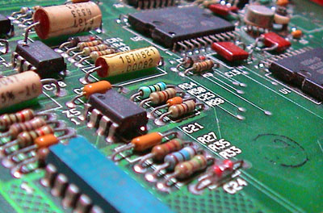

There is something haunting about an unpopulated PCB. It’s a map of a city that hasn't been built yet. 

I’ve been spending my evenings staring at the trace routes on the new Scribbles hardware interface. The way the copper paths curve to avoid interference reminds me of the river paths around Montreal. We spend so much time worrying about the "logic" of the chips, but the physical layout is where the soul of the machine actually.

Next week, we start soldering the logic gates. For now, I'm just enjoying the silence of the green fiberglass.

